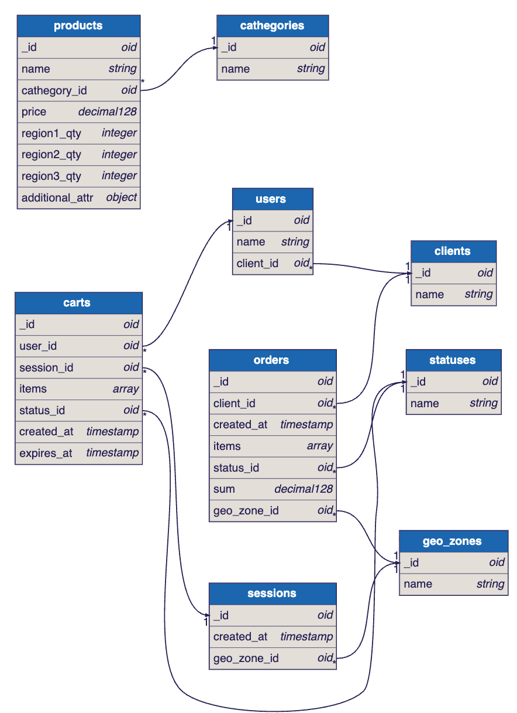

### **Название задачи:** Разработка новой модели данных
### **Автор:** avoytenkov@yandex.ru
### **Дата:** 06.01.2026

## Варианты решения

### Задание 7. Проектирование схем коллекций для шардирования данных

Схемы коллекций MongoDB, в которых хранятся заказы, товары и корзины, изображены на следующей диаграмме:



В результате проведенного анализа основных операций с коллекциями orders, products и carts предложены следующие параметры шардирования.

Кандидаты для шард-ключей и стратегии шардирования:

Для коллекции **orders**:
|Ключ-шардирования|Стратегия шардирования|Обоснование|
|-|-|-|
|geo_zone_id|геошардирование|Для того, чтобы информация о заказах хранилась в шарде базы данных, расположенном ближе к региону заказа, быстрее будут выполняться запросы.|

Для коллекции **products**:
|Ключ-шардирования|Стратегия шардирования|Обоснование|
|-|-|-|
|price|диапазонное|так как выполняется фильтрация по диапазону цен и быстрее будут выбираться данные, расположенные в одном шарде|
|cathegory|диапазонное|категорий много, важно не то, в каком кокретном шарде они находятся, а то, чтобы все продукты одной категории были в одном шарде. Но есть опасность перегрузки шардов из-за неравномерного распределения продуктов по категориям|

Для коллекции **carts**:
|Ключ-шардирования|Стратегия шардирования|Обоснование|
|-|-|-|
|session_id|геошардирование|Геозона корзины, а потом будущего заказа, получается из геозоны сессии, а она в свою очередь вычисляется по ip-адресу посетителя сайта. При преобразовании корзины в заказ данные будут перемещаться в пределах одного шарда.|

Примечание:
1. Я не проводил анализ атрибутов массива items, представляющих список товаров, и в свою очередь являющегося атрибутом коллекция Orders и Carts, так как в списке товаров будут разнородные товары и по ним не представляется возможным выявить закономерность для выработки стратегии шардирования. 

### Задание 8. Выявление и устранение «горячих» шардов

Для выявления потенциальных "горячих шардов" лучше проводить нагрузочные тестирования с разными вариантами выбора ключа и настройки стратегии шардирования. Для отслеживания состояния шардов нможно использовать следующие метрики MongoDB:
* Chunk distribution — насколько равномерно данные распределены по шардам.
* Balancer activity — частота и длительность миграций шардов.
* Jumbo chunks — шарды, которые превышают максимальный размер и не могут быть разделены.
* Split operations — скорость, с которой шарды разделяются.
* Query targeting — распределение запросов на один или несколько шардов.

Стоит рассмотреть вариант автоматического шардирования средствами базы данных, может оказаться так, что этот вариант окажется оптимальным.

Как показала практика, шардирование по категориям может вылиться в появление "горячих" шардов, если не сразу, то в скором времени. Для предотвращения этой проблемы лучше использовать стратегии, которые помимо изначально равномерного распределения данных по шардам могут обеспечить незатратные по ресурсам алгоритмы перебалансировки, например, **консистентное хэширование**. Это продвинутая техника, часто используемая с шардированием по хешу. Она минимизирует количество данных, которые нужно перемещать при добавлении или удалении шардов. Вместо простого hash % N, ключи и серверы отображаются на абстрактное кольцо. Данные закрепляются за ближайшим сервером на кольце. При добавлении/удалении сервера перераспределяется только небольшая часть ключей.

При большом количестве серверов, вероятность выхода из строя того или иного сервера возрастает. Необходимо выполнять ребалансировку шардов. Для этого можно использовать команду:
```
sh.startBalancer() — команда для повторного включения balancer.
```
Для операций балансировки флаг балансировки должен быть установлен в значение «true». Также можно определить окно балансировки для коллекции, указав, когда балансировщик может работать. Для этого используется команда:
```
 sh.updateZoneKeyRange( "myDatabase.myCollection", { _id: MinKey }, { _id: MaxKey }, { "balancing" : "true" } )
```
Это позволит выполнять балансировку в ненагруженное время.

Однако, при включенном автошардировании эта команда не имеет смысла, так как ребалансировка в этом случае выполняется автоматически.

### Задание 9. Настройка чтения с реплик и консистентность

Для коллекции **orders**:
|Операция чтения|Тип реплики|Обоснование|
|-|-|-|
|Поиск истории заказов конкретного пользователя|Primary|Недопустима неконсистентность данных, так как у покупателей будут возникать вопросы, где их заказы|
|Отображение статуса заказа|Secondary|Допустимо отображение неактуального заказа, так как операции по заказам выполняются асинхронно и в любом случае могут иметь задержку, а при наличии ручной обработки заказов, статус может меняться в течении нескольких дней|

Для коллекции **products**:
|Операция чтения|Тип реплики|Обоснование|
|-|-|-|
|Поиск товаров по категориям и фильтрация по диапазону цен|Secondary|Допустимо, если из выборки выпадут некоторые позиции|
|Описание товара на странице продукта|Primary|Описание товара должно быть максимально точное и актуальное|

Для коллекции **carts**:
|Операция чтения|Тип реплики|Обоснование|
|-|-|-|
|Получение текущей корзины по фильтру|Primary|Недопустимо отсутствие или неактуальные данные, так как у покупателей будут возникать вопросы, где их корзина или почему отсутствуют выбранные ими товары|

Допустимая задержка репликации разная для разных типов данных:
1. Обновление статусов - 1 минута cчитаю приемлемой величиной, чисто эмпирически больше 1 минуты уже будет много, если, например, смена статуса после оплаты, для статусов, когда заказ в обработке, там можно и 5 минут задержку.
2. Добавление новых товаров - 3-5 минут допустимо, это время между последовательными запросами покупателя, так как после запроса покупатель несколько минут изучает выборку товаров, а потом уточняет запрос. Но вообще лучше ориентироваться на метрики по переходу посетителя сайта.
И лучше стараться минимизировать задержки.

### Задание 10. Миграция на Cassandra: модель данных, стратегии репликации и шардирования

#### Задание 10.1. Критически важные данные

Не смотря на преимущества Cassandra, считаю, что она не подходит для некоторых критически важных типов данных, для которых неконсистентность недопустима, а именно:
1. Корзины и заказы.
2. Истории заказов.
3. Пользовательские сессии.  
Обоснование см. в задании 9.

Применение Cassandra может иметь смысл для каталога товаров, он обширный, здесь допустима неконсистентность, также можно учитывать геораспределенность и разные культурные предпочтения или требования к локализации товаров в зависимости от региона. Предпочтительна высокая скорость записи за счет расположения данных в регионе покупателя, чем большая консистентность. Требования к скорости записи будут ниже, так как операций чтения в интернет-магазине явно будет больше. 

#### Задание 10.2. Концептуальная модель для выбранных критически важных сущностей

Корзины и заказы:
Ключ шардирования - geo_zone_id

Пользовательские сессии - geo_zone_id

Не уверен, что геошардирование обеспечит равномерное распределение по шардам. Скорее всего равномерность надо будет учитывать при нарезке регионов и алгоритму распределения локаций по регионам (с учетом также дистанции и скорости каналов связи). Может получиться так, что количество покупателей в разных регионах все равно будет сильно отличаться, с учетом этого и надо планировать серверные мощности и количество шард базы данных в каждом регионе.

А лучше стремиться к тому, чтобы полный набор шардов присутствовал в каждом регионе за счет реплик в регионах. Тогда геошардирование особо смысла иметь не будет. И тогда можно использовать автошардирование или консистентное шардирование без выбора определенного атрибута для ключа.
Для выбранной схемы данных никакой partition key не даст гарантии равномерного распределение и отсутствия "горячих" шардов. Для минимизации влияния решардинга, как я писал выше, лучше использовать консистентное шардирование.

#### Задание 10.3. Выбор стратегии обеспечения целостности данных

Рассматриваем только товары и статусы заказов, так как для корзин, списка заказов и пользовательских сессий даже временная неконсистетность недопустима (см. выше).

Для товаров лучше выбрать стратегию Read Repair, так как товары - часто читаемые данные, а если какие-то никому не нужные товары не обновятся, то и ничего в этом страшного нет.

Для статусов лучше выбрать стратегию Hinted Handoff (для кратковременных сбоев) и Anti-Entropy Repair во всех остальных случаях, так как статусы всех текущих заказов рано или поздно надо будет актуализировать.