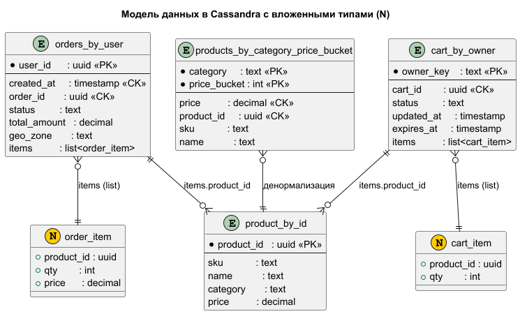

# Архитектурное решение для интернет-магазина "Мобильный мир"

Документ охватывает задания **7–10**:

- шардирование MongoDB и схемы коллекций;
- мониторинг и устранение «горячих» шардов;
- стратегия чтения с реплик;
- миграция части данных в Cassandra.
  
Дополнительно приведены **диаграммы и таблицы**, иллюстрирующие структуру кластеров и потоки данных.

---

## Задание 7. Проектирование схем коллекций для шардирования данных (MongoDB)

Цель - спроектировать коллекции `products`, `orders`, `carts`, выбрать шард-ключи и обосновать их.


### 1. Коллекция `products`

#### Структура:

```jsonc
{
  _id: ObjectId("..."),
  name: "SMARTPHONE_X_128_BLACK",
  description: "Смартфон X 128GB Black",
  category: "smartphones",
  price: 45990,
  attributes: { color: "black", memory: 128 },
  stock_by_zone: [ { zone: "MSK", qty: 50 }, { zone: "EKB", qty: 30 } ],
  updated_at: ISODate("2025-11-12T10:00:00Z")
}
````

#### Основные операции:

* выбор по категории и цене;
* чтение карточки товара;
* частые обновления поля `stock_by_zone`.

#### Выбор шард-ключа:

| Ключ            | Плюсы                | Минусы                     |
|-----------------|----------------------|----------------------------|
| `_id: "hashed"` | равномерность        | scatter-gather по фильтрам |
| `category`      | удобно для каталогов | низкая кардинальность      |

**Выбор:** `shardKey: { _id: "hashed" }`

```js
sh.enableSharding("somedb");
sh.shardCollection("somedb.products", { _id: "hashed" });
```

---

### 2. Коллекция `orders`

#### Структура:

```jsonc
{
  _id: ObjectId("..."),
  user_id: ObjectId("..."),
  created_at: ISODate("..."),
  status: "PAID",
  total_amount: 75980,
  geo_zone: "MSK",
  items: [
    { product_id: "...", qty: 1, price: 45990 },
    { product_id: "...", qty: 1, price: 2990 }
  ]
}
```

#### Основные операции:

* чтение истории заказов по `user_id`;
* создание и изменение статуса заказа.

#### Выбор шард-ключа:

| Ключ              | Плюсы                           | Минусы                   |
|-------------------|---------------------------------|--------------------------|
| `user_id: hashed` | локальность данных пользователя | аналитика scatter-gather |

💡 **Выбор:** `shardKey: { user_id: "hashed" }`

```js
sh.shardCollection("somedb.orders", { user_id: "hashed" });
```

---

### 3. Коллекция `carts`

#### Структура:

```jsonc
{
  _id: ObjectId("..."),
  user_id: ObjectId("..."),
  session_id: "sess123",
  owner_key: "user:abc123" or "sess:456def",
  status: "active",
  items: [ { product_id: "...", qty: 1 } ],
  expires_at: ISODate("..."),
  updated_at: ISODate("...")
}
```

`owner_key` = `"user:" + user_id` или `"sess:" + session_id`

#### Основные операции:

* чтение активной корзины пользователя;
* слияние корзин при логине;
* удаление старых.

#### Выбор шард-ключа:

| Ключ                | Плюсы                         |
|---------------------|-------------------------------|
| `owner_key: hashed` | локальность корзины владельца |

**Выбор:** `shardKey: { owner_key: "hashed" }`

```js
sh.shardCollection("somedb.carts", { owner_key: "hashed" });
```

---

### Итоговая таблица:

| Коллекция | Шард-ключ           | Причина                       |
|-----------|---------------------|-------------------------------|
| products  | `_id: hashed`       | равномерность                 |
| orders    | `user_id: hashed`   | история заказа на одном шарде |
| carts     | `owner_key: hashed` | локальное чтение/слияние      |

---

## Задание 8. Горячие шарды: метрики и стратегия

Из-за популярной категории "Электроника" произошла перегрузка одного из шардов.

### 8.1. Метрики мониторинга

| Метрика                           | Зачем                                  |
|-----------------------------------|----------------------------------------|
| QPS/ops/sec по шардам             | выявить перегрузку                     |
| Latency (p95) на операции         | рост задержек = признак горячего шарда |
| CPU/RAM/Disk IO per mongod        | неравномерное использование            |
| Кол-во чанков по шардов           | определить дисбаланс данных            |
| Балансировщик (статус/migrations) | работает ли выравнивание               |

---

### 8.2. Стратегии устранения

* **Пересмотр шард-ключа** (hashed вместо category).
* **Принудительный split/moveChunk** на горячих чанках.
* **Zone sharding** по геозонам/категориям -> группы шардов.
* **Redis caching** для товаров и категорий -> снижение ударной нагрузки.
* **Авто-алерты** по перекосу нагрузки (единый шард >50% запросов).

---

## Задание 9. Настройка чтения с реплик

Требуется определить, какие запросы читает с `primary`, а какие допустимо - с `secondary`.

### Таблица:

| Коллекция | Операция                   | Primary/Secondary | Допустимая задержка | Обоснование    |
|-----------|----------------------------|-------------------|---------------------|----------------|
| products  | Каталог, карточки          | Secondary         | 1–5 сек             | eventual ok    |
| products  | Проверка остатков          | Primary           | ~0 сек              | анти-oversell  |
| orders    | Только что созданный заказ | Primary           | ~0 сек              | UX, финансы    |
| orders    | История заказов            | Secondary         | 5–10 сек            | не критично    |
| carts     | Активная корзина / merge   | Primary           | ~0 сек              | UX-critical    |
| carts     | Аналитика корзин           | Secondary         | 30–60 сек           | можно отложить |

---

## Задание 10. Миграция на Cassandra

### 10.1. Что переносим и почему

| Тип данных                 | Почему Cassandra                           |
|----------------------------|--------------------------------------------|
| История заказов (`orders`) | append-only, огромный объём, линейный рост |
| Корзины (`carts`)          | высокочастотные записи, TTL                |
| Каталог витринных запросов | денормализация для фильтров                |
| Сессии / трекинг поведения | временные данные, развёртка по регионам    |


---

### 10.2. Модели данных

#### История заказов

```sql
CREATE TYPE shop.order_item (
  product_id uuid,
  qty        int,
  price      decimal
);

CREATE TABLE shop.orders_by_user (
  user_id      uuid,
  created_at   timestamp,
  order_id     uuid,
  status       text,
  total_amount decimal,
  geo_zone     text,
  items        list<frozen<order_item>>,
  PRIMARY KEY ((user_id), created_at, order_id)
) WITH CLUSTERING ORDER BY (created_at DESC, order_id ASC);

```

* **Partition key:** `user_id`
* Позволяет быстро выбирать историю заказа

---

#### Корзины

```sql
CREATE TYPE shop.cart_item (
  product_id uuid,
  qty        int
);

CREATE TABLE shop.cart_by_owner (
  owner_key  text,
  cart_id    uuid,
  status     text,
  updated_at timestamp,
  expires_at timestamp,
  items      list<frozen<cart_item>>,
  PRIMARY KEY ((owner_key), cart_id)
) WITH CLUSTERING ORDER BY (cart_id DESC);

```

* Доступ по `owner_key` -> единая корзина владельца

---

#### Товары по категории

```sql
CREATE TABLE shop.product_by_id (
  product_id    uuid,
  sku           text,
  name          text,
  category      text,
  price         decimal,
  stock_by_zone map<text, int>,
  updated_at    timestamp,
  PRIMARY KEY ((product_id))
);

CREATE TABLE shop.products_by_category_price_bucket (
  category text,
  price_bucket int,
  price decimal,
  product_id uuid,
  PRIMARY KEY ((category, price_bucket), price, product_id)
);
```

* `price_bucket` помогает избежать горячих партиций


---

### 10.3. Стратегии обеспечения согласованности

| Сущность                                             | Write CL / Read CL                                                     | Стратегии                                               | Обоснование                                                      |
|------------------------------------------------------|------------------------------------------------------------------------|---------------------------------------------------------|------------------------------------------------------------------|
| `orders_by_user`                                     | `LOCAL_QUORUM / LOCAL_QUORUM`                                          | Read Repair (умеренный), регулярный Anti-Entropy Repair | важно, чтобы история и статусы заказов были консистентны         |
| `cart_by_owner`                                      | `LOCAL_ONE / LOCAL_ONE` (для скорости), при merge можно `LOCAL_QUORUM` | Hinted Handoff, периодический (ограниченный) repair     | корзины живут недолго; важен низкий latency                      |
| `product_by_id`, `products_by_category_price_bucket` | `LOCAL_QUORUM / LOCAL_ONE` или `LOCAL_ONE / LOCAL_ONE` для витрин      | Hinted Handoff, периодический repair                    | витрина может быть чуть устаревшей, но потери данных недопустимы |

---

## Резюме

* **MongoDB:**

    * Используем `hashed` ключи, чтобы избежать hotspot’ов.
    * Настроены правила чтения с primary и secondary в зависимости от сценария.
    * Метрики и автоматизация помогают предсказать и устранить перегрузку.

* **Cassandra:**

    * Используется для write-heavy, распределённых, временных данных.
    * Модели ориентированы на запросы (таблицы -> сценарии).
    * Consistency Level и фоновые стратегии подбираются индивидуально.

