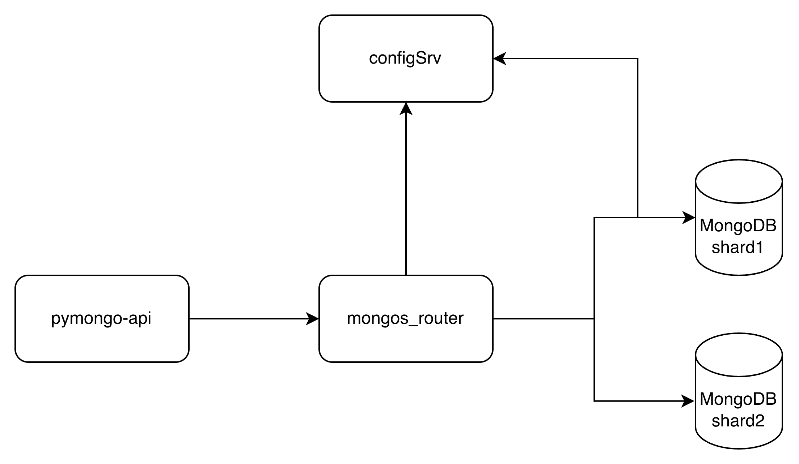
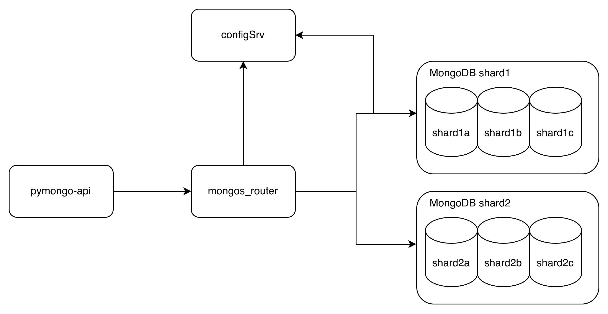
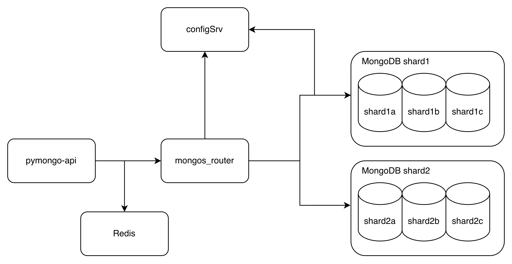
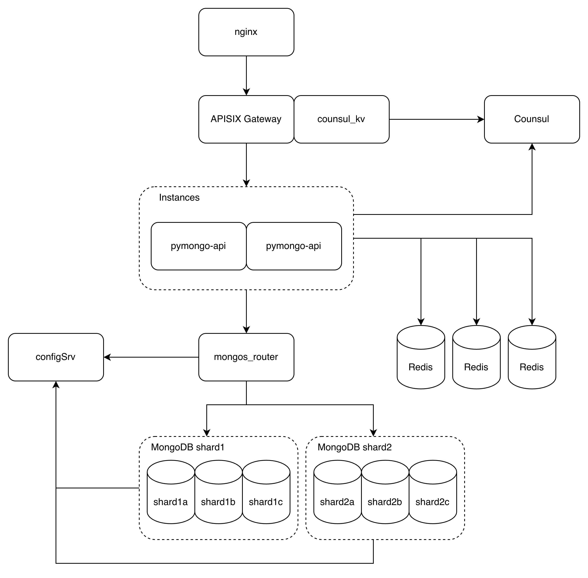
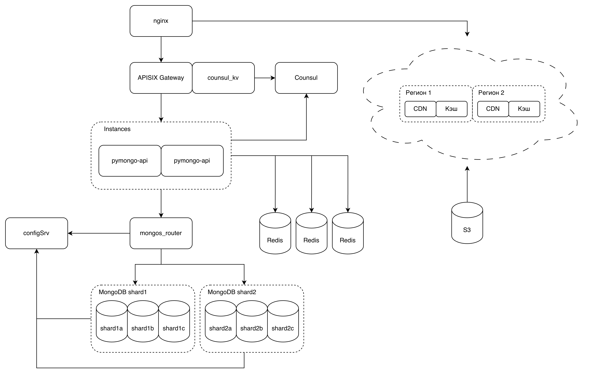

# pymongo-api

## Схемы

### Для задания 1

<details>



</details>

### Для задания 3

<details>



</details>

### Для задания 4

<details>



</details>

### Для задания 5

<details>



</details>

### Для задания 6

<details>



</details>

### Финальная схема

<details>


</details>

или по ссылке
[Схема drawio](./docs/final-schema.drawio)

## Как запустить

Перейти в папку mongo-sharding-repl

```shell
cd mongo-sharding-repl
```

Запускаем mongodb и приложение

```shell
docker compose up -d
```

Заполняем mongodb данными

```shell
./scripts/mongo-init.sh
```

## Как проверить

### Если вы запускаете проект на локальной машине

Откройте в браузере http://localhost:8080

### Если вы запускаете проект на предоставленной виртуальной машине

Узнать белый ip виртуальной машины

```shell
curl --silent http://ifconfig.me
```

Откройте в браузере http://<ip виртуальной машины>:8080

## Доступные эндпоинты

Список доступных эндпоинтов, swagger http://<ip виртуальной машины>:8080/docs
