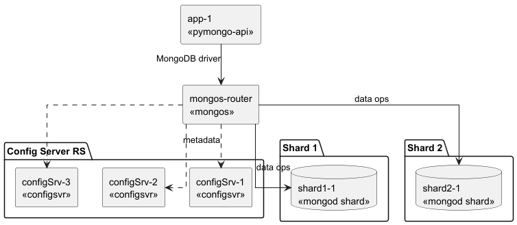
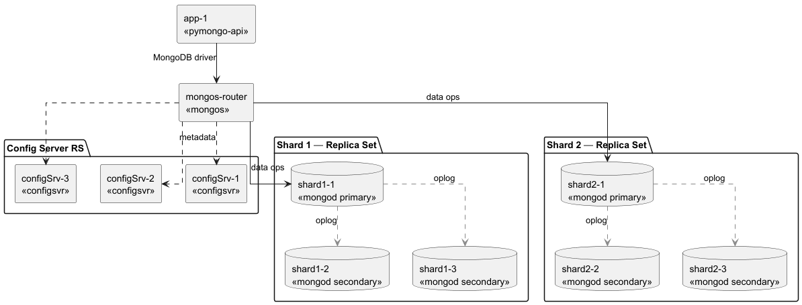
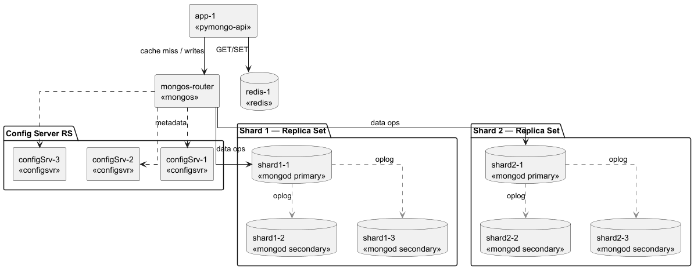

# pymongo-api
**Состав проекта:**

- single-node - приложение с одним инстансом mongo-db
- mongo-sharding - приложение с двумя шардами  MongoDВ

- mongo-sharding-repl - приложение с двумя репликасетами шардов MongoDВ

- sharding-repl-cache - приложение с двумя репликасетами шардов MongoDВ и кэширование

- schema.drawio - схема 5 вариантов реализаций. Каждый вариант на отдельном листе.
- [ADR7-10.md](ADR7-10.md) - описание решений заданий от 7 до 10.

## Как запустить
1. **Запустите все сервисы:**
```bash
docker compose up -d
```

2. **Дождитесь инициализации кластера:**
Проверьте логи сервиса `cluster-init`:
```bash
docker compose logs cluster-init
```
Дождитесь сообщения `===> Cluster initialization complete`

3. **Заполнение базы данных тестовыми данными:**
Заполнение базы данных происходит автоматически через сервис `mongo-data-init` после успешной инициализации кластера. Сервис использует скрипт `scripts/mongo-init.sh`, который автоматически определяет, запущен ли он внутри Docker контейнера или на хосте, и использует соответствующий способ подключения к MongoDB.

**Проверьте логи:**
```bash
docker compose logs mongo-data-init
```
Дождитесь сообщения об успешном завершении инициализации данных.

**Примечание:**
Если нужно заполнить базу данных вручную, можно использовать скрипт `scripts/mongo-init.sh`:
```bash
chmod +x scripts/mongo-init.sh
./scripts/mongo-init.sh
```
## Как проверить

Проверить статус сервисов можно командой.

```shell
docker compose ps
docker compose logs mongo-data-init
docker compose logs cluster-init
```

### Если вы запускаете проект на локальной машине

Откройте в браузере http://localhost:8080

```shell
curl http://localhost:8080
```
### Если вы запускаете проект на предоставленной виртуальной машине

Узнать белый ip виртуальной машины

```shell
curl --silent http://ifconfig.me
```

Откройте в браузере http://<ip виртуальной машины>:8080

## Доступные эндпоинты

Список доступных эндпоинтов, swagger http://<ip виртуальной машины>:8080/docs