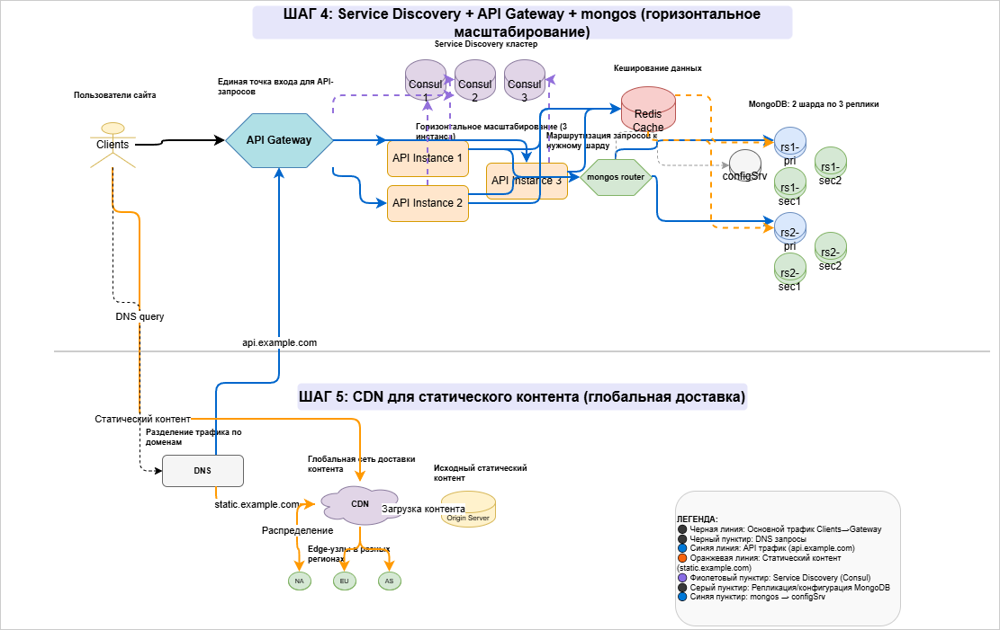

# pymongo-api

## Как запустить (Windows)

### Последовательность разворачивания

#### 1. Запуск инфраструктуры
Запускаем все контейнеры (MongoDB шарды, Redis, приложение):

```batch
docker compose up -d
```

#### 2. Быстрая настройка всего кластера (рекомендуется)
Используйте подготовленный скрипт для полной настройки шардирования и кеширования:

```batch
setup-cache.bat
```

Скрипт автоматически выполнит:
- Инициализацию конфигурационного сервера
- Инициализацию реплика-сетов rs1 и rs2 (по 3 узла)
- Добавление шардов в кластер
- Настройку шардирования для базы somedb
- Заполнение 1000 тестовых документов в коллекции helloDoc
- Проверку кеширования через Redis

#### 3. Альтернативная настройка с дополнительными данными
Для создания более сложной структуры с товарами, заказами и корзинами:

```batch
optimize.bat
```

Этот скрипт создаст базу `mobile_mir` с:
- 1000 товаров по категориям
- 20 заказов
- 10 корзин
- Индексами для оптимизации запросов
- Демонстрацией запросов с разными read preference

---

## Проверка работы

### Мониторинг состояния шардов

```batch
monitor.bat
```

Скрипт покажет:
- Список активных шардов
- Распределение чанков между шардами
- Популярность категорий товаров

### Тестирование производительности кеша

```batch
benchmark.bat
```

Скрипт выполняет:
1. Проверку доступности приложения
2. Очистку кеша Redis
3. Прогрев (первый запрос без кеша)
4. 5 последовательных запросов с измерением времени
5. Расчет среднего времени ответа
6. Проверку заголовков X-Cache и X-Query-Time
7. Статистику Redis (keyspace_hits/misses)
8. Просмотр ключей в Redis

### Проверка в браузере

**Локальный запуск:**
http://localhost:8080

text

**На виртуальной машине:**
Узнать внешний IP:
```batch
curl --silent http://ifconfig.me
```
Открыть в браузере:
http://<внешний-IP>:8080

text

---

## Доступные эндпоинты

| Метод | Эндпоинт | Описание | Кеширование |
|-------|----------|----------|-------------|
| GET | `/` | Информация о БД (общее количество документов) | ❌ Нет |
| GET | `/helloDoc/users` | Список всех пользователей | ✅ Да (60 сек) |
| GET | `/helloDoc/user/{id}` | Информация о конкретном пользователе | ✅ Да (60 сек) |
| POST | `/helloDoc/user` | Создание нового пользователя | ❌ Нет (инвалидация кеша) |
| PUT | `/helloDoc/user/{id}` | Обновление пользователя | ❌ Нет (инвалидация кеша) |
| DELETE | `/helloDoc/user/{id}` | Удаление пользователя | ❌ Нет (инвалидация кеша) |

Swagger-документация: http://localhost:8080/docs

---

## Диагностика и полезные команды

### Проверка логов
```batch
docker compose logs pymongo-api
docker compose logs mongos
docker compose logs redis
```

### Доступ к MongoDB
```batch
docker compose exec mongos mongosh --port 27017
```

### Доступ к Redis
```batch
docker compose exec redis redis-cli
```

### Очистка кеша Redis
```batch
docker compose exec redis redis-cli flushall
```

### Полная остановка и удаление данных
```batch
docker compose down -v
```

---

## Диаграммы архитектуры (задания 1-6)



*Диаграмма демонстрирует разделение трафика через DNS: api.example.com идёт на API Gateway, static.example.com — на CDN с Anycast-маршрутизацией.*

---

## Структура директорий задач
tasks/
├── [task-1](./tasks/task-1)/
│   ├── [diagram.drawio](./tasks/task-1/diagram.drawio)
│   └── [diagram.drawio.png](./tasks/task-1/diagram.drawio.png)
├── [task-5](./tasks/task-5)/
│   ├── [diagram.drawio](./tasks/task-5/diagram.drawio)
│   └── [diagram.drawio.png](./tasks/task-5/diagram.drawio.png)
└── [task-6](./tasks/task-6)/
    ├── [diagram.drawio](./tasks/task-6/diagram.drawio)
    └── [diagram.drawio.png](./tasks/task-6/diagram.drawio.png)

text

## Примечания

- Для задач 2, 3, 4 используются те же диаграммы, что и для задач 1, 5, 6 с соответствующими изменениями
- Полные версии диаграмм в редактируемом формате (.drawio) находятся в соответствующих директориях
- Для просмотра PNG-версий достаточно открыть их в любом браузере или просмотрщике изображений
- Все .bat скрипты используют кодировку UTF-8 для корректного отображения русского текста
- Время жизни кеша в Redis настроено на 60 секунд (переменная REDIS_TTL в compose.yaml)