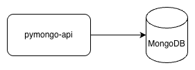
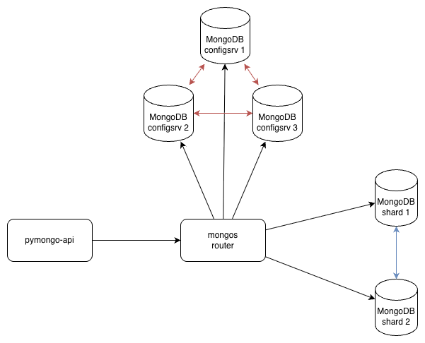
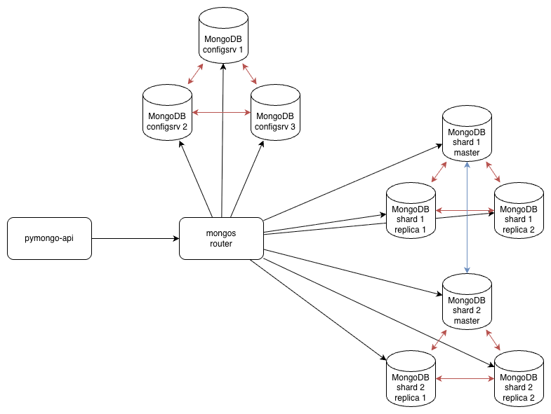
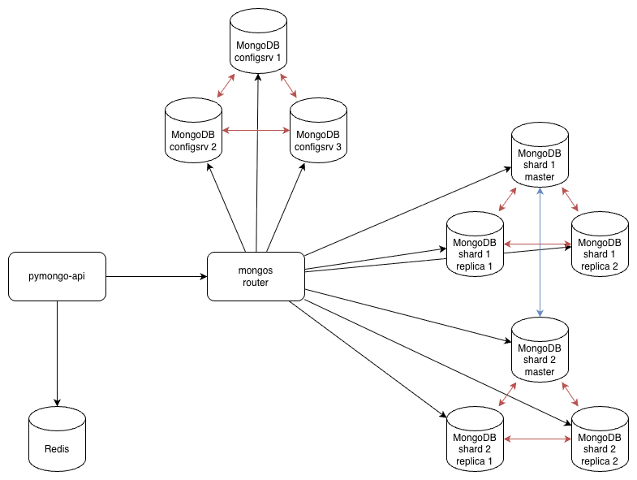
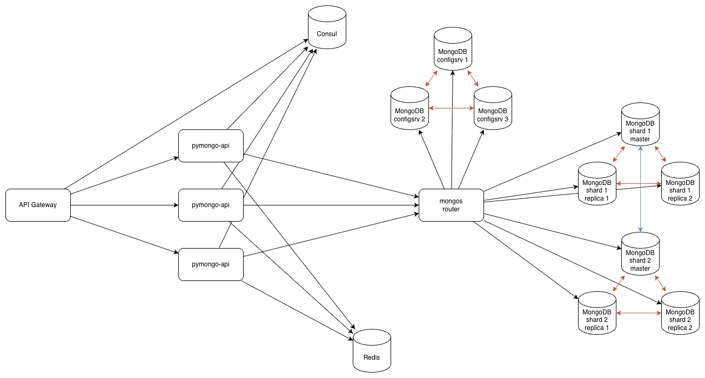
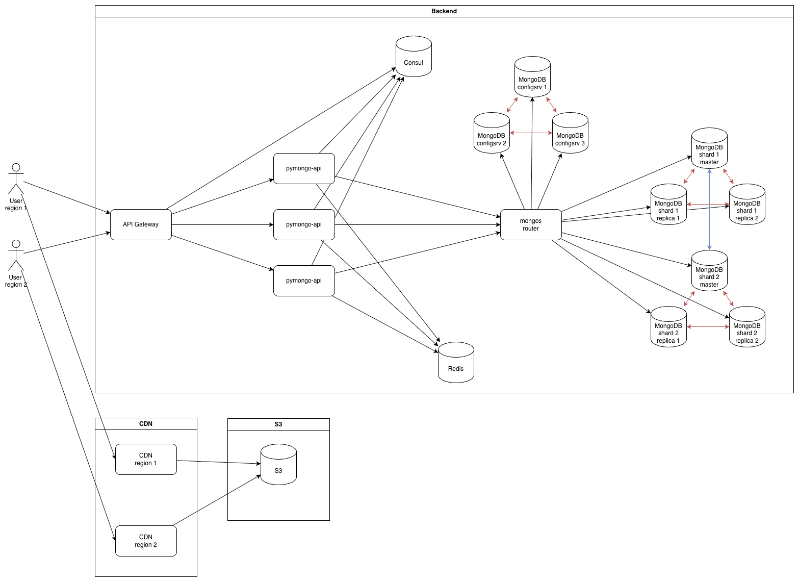

# pymongo-api

## Задание 1

Схемы:
- Изначальная: 
- Шардирование: 
- Репликация: 
- Кеш: 


## Задание 2

```shell
cd mongo-sharding
docker compose up -d
./scripts/mongo-init.sh
```

Открыть: http://localhost:8080


## Задание 3

```shell
cd mongo-sharding-repl
docker compose up -d
./scripts/mongo-init.sh
```

Открыть: http://localhost:8080


## Задание 4

```shell
cd sharding-repl-cache
docker compose up -d
./scripts/mongo-init.sh
```

Открыть: http://localhost:8080

Проверка кеширования:
```bash
time curl -s http://localhost:8080/helloDoc/users > /dev/null
```

## Задание 5

Схема: 


## Задание 6

Схема: 


## Задание 7

[Проектирование схем коллекций для шардирования](./task7/README.md)


## Задание 8

[Выявление и устранение горячих шардов](./task8/README.md)


## Задание 9

[Настройка чтения с реплик и консистентность](./task9/README.md)


## Задание 10

[Миграция на Cassandra](./task10/README.md)
