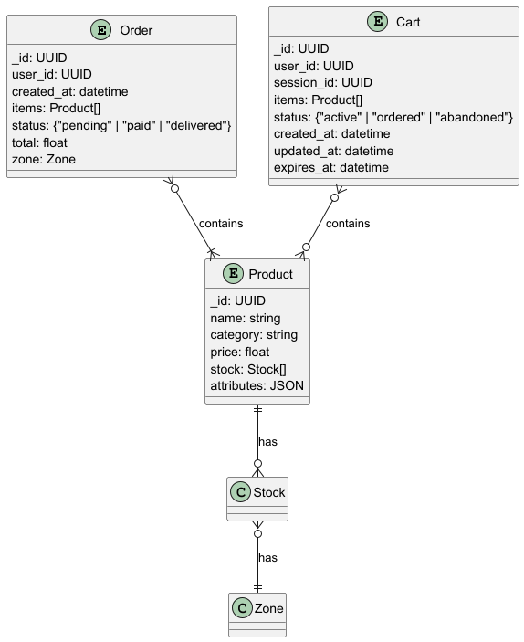

# Архитектурное решение

## Задание 7. Проектирование схем коллекций для шардирования данных

### В условиях:

Приложение «Мобильный мир» хранит информацию о заказах, товарах и корзинах в трёх коллекциях в MongoDB.

1. **Коллекция orders** включает заказы клиентов и содержит атрибуты:
    - Уникальный идентификатор заказа;
    - Идентификатор клиента;
    - Дату и время оформления заказа;
    - Список заказанных товаров и их цену;
    - Статус заказа;
    - Общую сумму заказа;
    - Геозону заказа.  
      **Например**, заказ пользователя из Москвы может включать товары из категорий «Электроника» и «Книги».  
      **Основные операции:**
        - Быстрое создание заказов с одновременным списанием остатков.
        - Поиск истории заказов конкретного пользователя.
        - Отображение статуса заказа.
2. **Коллекция products** хранит сведения о товарах и включает такие атрибуты:
    - Уникальный идентификатор товара;
    - Наименование;
    - Категорию товара;
    - Цену;
    - Остаток товара в каждой геозоне;
    - Дополнительные атрибуты (цвет, размер).  
      **Например**, в Екатеринбурге есть в наличии 50 штук товара «Смартфон X», а в Калининграде — 30.  
      **Основные операции:**
        - Частые обновления остатков при покупках.
        - Поиск товаров по категориям и фильтрация по диапазону цен.
        - Описание товара на странице продукта.
3. **Коллекция carts** хранит данные о текущих корзинах (как гостевых, так и пользовательских) и включает атрибуты:
    - Уникальный идентификатор корзины (_id);
    - Идентификатор пользователя (user_id) и session_id для гостей;
    - Список товаров (items): массив документов { product_id, quantity };
    - Статус корзины (status): "active" | "ordered" | "abandoned";
    - Дату и время создания (created_at);
    - Дату и время последнего обновления (updated_at);
    - Время удаления (TTL) (expires_at) — для автоматической очистки старых корзин.  
      **Основные операции:**
        - Создание корзины, когда заходит гость или новый пользователь.
        - Получение текущей корзины по фильтру { session_id, status:"active" } или { user_id, status:"active" }.
        - Добавление или замена товара в корзине.
        - Удаление товара из корзины.
        - Слияние гостевой корзины в пользовательскую, если пользователь залогинится:
            - прочитать гостевую { session_id, status:"active" };
            - добавить её items в корзину { user_id, status:"active" };
            - отметить гостевую как abandoned.
            - Отметка корзины как заказанной.

### Необходимо добиться:

Обеспечить эффективное распределение данных по шардам.

### Решение

[entity-relation.plantuml](../diagrams/entity-relation.plantuml)



Для **коллекции orders** используется стратегия хэшированного шардирования (ключ - идентификатор клиента); основные
достоинства такого решения следующие:

- распределение по шардам будет во всяком случае равномерным (при условии, что идентификаторы назначаются удачно; можно
  ожидать, что будет использован UUID);
- облегчается поиск истории заказов клиента;

[orders.schema.json](../schemas/orders.schema.json)

[orders-operations.mongoDb.js](../schemas/orders-operations.mongoDb.js)

Для **коллекции products** используется стратегия диапазонного шардирования (ключ - категория товара); основные
достоинства такого решения следующие:

- облегчается поиск товара по категориям;
- не осложнен поиск по диапазонам цен в пределах одной категории;

[products.schema.json](../schemas/products.schema.json)

[products-operations.mongoDb.js](../schemas/products-operations.mongoDb.js)

Для **коллекции carts** используется стратегия хэшированного шардирования (ключ - идентификатор пользователя/сессии);
основные достоинства такого решения следующие:

- распределение по шардам будет во всяком случае равномерным (при условии, что идентификаторы
  назначаются удачно; можно ожидать, что будет использован UUID);
- облегчается поиск по идентификаторам сессии/пользователя и статусу

[carts.schema.json](../schemas/carts.schema.json)

[carts-operations.mongoDb.js](../schemas/carts-operations.mongoDb.js)

### При известных альтернативах

Для **заказов** можно применить стратегии:

- хэшированного шардирования (ключ - идентификатор заказа);
    - *Достоинства*: распределение по шардам будет во всяком случае равномерным (при условии, что идентификаторы
      назначаются удачно; можно ожидать, что будет использован UUID);
    - *Недостатки*:
        - попадание разных заказов одного клиента в разные шарды, что отрицательно скажется на функционале поиска
          заказов клиента;
        - попадание заказов с одинаковой геолокацией в разные шарды, что может отрицательно сказаться на
          работе, если возникнет функционал, связанный с геолокацией (например, системы для локальных складов);
- геошардинга (ключ - геолокация заказа);
    - *Достоинства*: при возникновении функционала, связанного с геолокацией (например, системы для локальных складов),
      время поиска заказов заметно улучшится;
    - *Недостатки*:
        - распределение по шардам может оказаться неравномерным, что придется парировать настройкой геошардов;
        - в случае, когда идентификатор клиента не будет соответствовать геолокации заказа, будет затруднен поиск
          заказов клиента.

Для **товаров** возможно применить стратегии:

- хэшированного шардирования (ключ - идентификатор товара);
    - *Достоинства*: распределение по шардам будет во всяком случае равномерным (при условии, что идентификаторы
      назначаются удачно; можно ожидать, что будет использован UUID);
    - *Недостатки*: затруднен поиск товаров по категориям и диапазону цен;
- хэшированного шардирования (ключ - категория товара);
    - *Достоинства*: облегчается поиск товара по категориям;
    - *Недостатки*:
        - затруднен поиск товаров по диапазону цен;
        - неравномерного распределения данных по шардам из-за различного наполнения разных категорий;
- диапазонного шардирования (ключ - цена товара);
    - *Достоинства*: облегчается поиск товара по диапазону цен;
    - *Недостатки*:
        - будет затруднен поиск товаров по категориям;
        - риск неравномерного распределения данных по шардам (возможно парировать ручной настройкой диапазонов);
        - при колебаниях цен сравнительно часто будет происходить миграция данных между шардами.

Для **корзин** возможно применить стратегии:

- хэшированного шардирования (ключ - идентификатор корзины);
    - *Достоинства*: распределение по шардам будет во всяком случае равномерным (при условии, что идентификаторы
      назначаются удачно; можно ожидать, что будет использован UUID);
    - *Недостатки*: затруднен поиск по идентификаторам сессии/пользователя и статусу;
- диапазонного шардирования (ключ - статус корзины);
    - *Достоинства*: облегчается поиск по идентификаторам сессии/пользователя и статусу
    - *Недостатки*:
        - распределение по шардам будет неравномерным;
        - частые миграции между шардами из-за смены статуса;
        - малое число шардов затруднит дальнейшее масштабирование;

### Принимая во внимание ограничения

Для **коллекции orders** возможно попадание заказов с одинаковой геолокацией в разные шарды, что может отрицательно
сказаться на работе, если возникнет функционал, связанный с геолокацией (например, системы для локальных складов).

Для **коллекции products** возможно

- затруднение поиска товаров по диапазону цен вне категории (представляется маловероятным вариантом);
- неравномерное распределение данных по шардам (возможно парировать ручной настройкой диапазонов).

## Задание 8. Выявление и устранение «горячих» шардов

### В условиях:

Из-за категории «Электроника» произошла перегрузка одного из шардов MongoDB, так как 70% запросов приходилось именно на
эти товары. Поэтому сейчас нужно разработать стратегию, как выявлять и устранять такие «горячие» шарды, а ещё предложить
метрики мониторинга, чтобы в будущем можно было предотвращать такие ситуации. Не забудьте учесть, что товары из
популярных категорий могут создавать непропорциональную нагрузку на отдельные узлы.

### Необходимо добиться:

Своевременного выявления "горячих" (перегруженных запросами) шардов и их разгрузки.

- Разработать набор метрик, чтобы отслеживать состояние шардов.
- Предложить механизмы автоматического перераспределения данных.

### Решение

#### Метрики

*Примечание*: рассматривались только метрики, предоставляемые утилитой `mondostat`.

*Примечание*: `mongostat` возвращает значения, отражающие операции за 1-секундный период. Однако если указать для
параметра `sleeptime` значение больше 1, `mongostat` усредняет статистику, чтобы показать среднее количество
операций в секунду. Таким образом возможно собирать усреднённые величины за более протяженные интервалы времени.

Для определения состояния шардов в целях выявления "горячих" шардов используются метрики:

- Основные:
    - netIn -- Объём сетевого трафика (в байтах), полученного экземпляром MongoDB.
    - netOut -- Объём сетевого трафика (в байтах), отправленного экземпляром MongoDB.
- Вспомогательные:
    - size -- Объём виртуальной памяти (в мегабайтах), используемый процессом на момент последнего вызова mongostat.
    - res -- Объём резидентной памяти (в мегабайтах), используемой процессом на момент последнего вызова mongostat.
    - locked db -- Процент времени, проведённого в контекстно-специфичной блокировке для конкретной базы данных.
      Mongostat показывает имя базы данных, которая потратила больше всего времени на блокировку записи с момента
      последнего вызова mongostat. Это значение включает время, проведённое базой данных в блокировке, а также время,
      проведённое в глобальной блокировке mongod. Из-за этого, а также из-за метода выборки данных, значение может
      превышать 100%.

Для того чтобы делать выводы о наличии "горячего" шарда желательна метрика "доля нагрузки":

```
NetRatio = Net(Shard) / Net(Total), где
    Net(Total) = netIn + netOut, рассчитанные для роутера
    Net(Shard) = netIn + netOut, рассчитанные для шарда
```

Пороговым значением такой метрики можно считать `NetRatio > K/N`, где K - коэффициент превышения, а N - число шардов.
Превышение порогового значения означает, что заметно превышена средняя ожидаемая нагрузка на шард.
Для малого числа шардов (2-3) коэффициент можно принять K=1.3 или К=1.5, а для большего числа -- K=2.

Сбор метрик можно реализовать командой:

```shell
mongostat --host shard-1-master
```

По возможности, для отслеживания метрик желательно использовать специализированные инструменты мониторинга типа
`Prometheus` и `Grafana`.

#### Перераспределение данных

**Профилактика "горячих" шардов (штатная процедура)**

Как штатная процедура предлагается автоматическая балансировка MongoDb. Этот механизм позволяет равномерно распределять
данные по доступным шардам по признаку объема.

```shell
sh.startBalancer();
sh.setBalancerConfig({ "maxTimeBetweenRunsSecs": 86400 })
```

**Устранение пиковой нагрузки (нештатная процедура)**

В случае выявления "горячего" шарда, угрожающего работоспособности системы несмотря на штатную процедуру
перебалансировки, предлагается ручная перебалансировка средствами MongoDB. Такой подход позволяет оперативно парировать
высокую нагрузку на шард в случае пиковых нагрузок (в порядке нештатной процедуры).

Для выноса части данных "горячего" шарда можно использовать какой-либо из низконагруженных шардов, но предпочтительнее
(если позволяют наличные ресурсы и время) развернуть дополнительный шард до момента спада пиковых нагрузок.

```shell
sh.moveChunk("mydb.products", { "category": "Electronics" }, "shard-2")
```

### При известных альтернативах

#### Метрики

*Примечание*: рассматривались только метрики, предоставляемые утилитой `mondostat`.

Метрики операций могут использоваться для оценки нагрузки на экземпляр БД.

- inserts -- Количество объектов, вставленных в базу данных в секунду.
- query -- Количество операций чтения (запросов) в секунду.
- update -- Количество операций обновления в секунду.
- delete -- Количество операций удаления в секунду.
- getmore -- Количество операций «getmore» (т.е. получение следующей партии данных курсора) в секунду.
- command -- Количество команд в секунду. На slave и secondary узлах mongostat показывает два значения, разделённые
  знаком вертикальной черты (|), в формате: локальные|реплицированные команды.

Их использование сравнительно информативно, однако не так ярко характеризует нагрузку, как объем трафика.

Метрики внутренней работ БД более полезны для отслеживания технических проблем экземпляра, чем нагрузки.

- flushes -- Количество операций fsync в секунду.
- mapped -- Общий объём данных, отображённых в память (в мегабайтах).
- faults -- Количество page faults в секунду.
- idx miss -- Процент обращений к индексу, при которых произошёл page fault для загрузки узла B-дерева.

Метрики соединений могут быть полезны для выявления общих технических проблем, но поскольку по одному соединению могут
проходить многие запросы, они сравнительно мало характеризуют нагрузку.

- qr -- Длина очереди клиентов, ожидающих чтения данных из экземпляра MongoDB.
- qw -- Длина очереди клиентов, ожидающих записи данных в экземпляр MongoDB.
- ar -- Количество активных клиентов, выполняющих операции чтения.
- aw -- Количество активных клиентов, выполняющих операции записи.
- conn -- Общее количество открытых соединений.

#### Перераспределение данных

Возможной альтернативой является ручное переразбиение по ключам шардирования (например, введение более дробных категорий
товаров).
- **Преимущества**: хорошая степень контроля над результатами разбиения данных;
- **Недостатки**: невозможность автоматического использования в качестве реакции на сложившуюся ситуацию (в силу
необходимости тщательного анализа и ручного перепроектирования разбиения данных).

### Принимая во внимание ограничения

Автоматическая перебалансировка нечувствительна к нагрузке, ориентируется только на размер данных.

Ручная перебалансировка требует ручного вмешательства и правильного выбора фрагмента данных для решения проблемы, то
есть квалифицированного персонала.