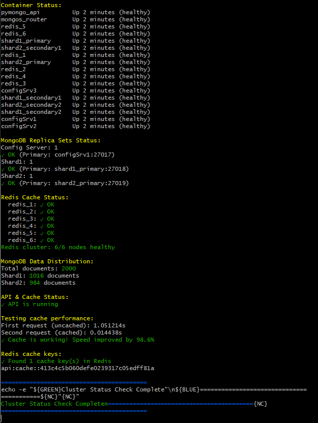
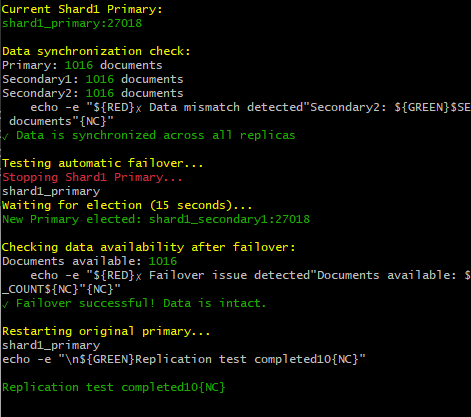
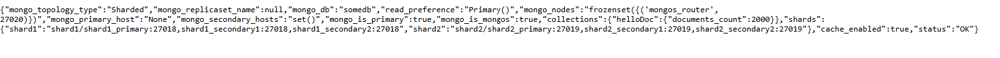
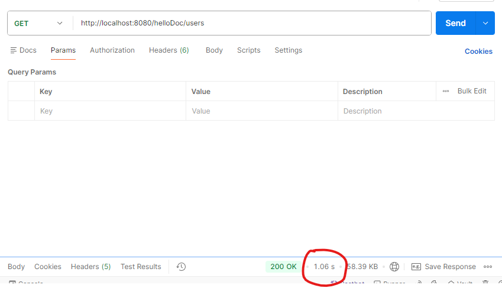
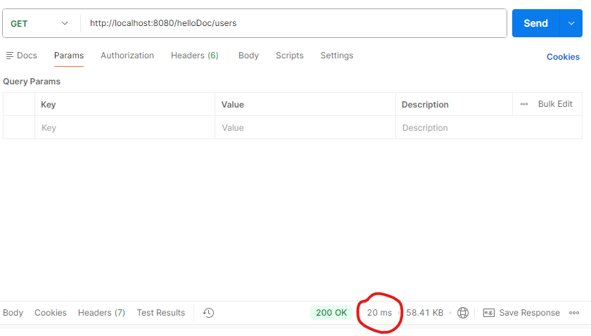

# pymongo-api

## Как запустить

переходим в папку со скриптами
```shell
cd путь-к-проекту\mongo-sharding-repl-cache\scripts
```
выполняем скрипт init-cluster.sh
```shell
.\init-cluster.sh
```

## Как перезапустить

переходим в папку со скриптами
```shell
cd путь-к-проекту\mongo-sharding-repl-cache\scripts
```
выполняем скрипт reset-cluster.sh
```shell
.\reset-cluster.sh
```
далее выполняем скрипт init-cluster.sh
```shell
.\init-cluster.sh
```

## Как проверить

переходим в папку со скриптами
```shell
cd путь-к-проекту\mongo-sharding-repl-cache\scripts
```
выполняем скрипт status-cluster.sh
```shell
.\status-cluster.sh
```

Результат будет похож на:



### проверка репликации

переходим в папку со скриптами
```shell
cd путь-к-проекту\mongo-sharding-repl-cache\scripts
```
выполняем скрипт test-replication.sh
```shell
.\test-replication.sh
```

Результат будет похож на:




### Если вы запускаете проект на локальной машине

Откройте в браузере http://localhost:8080

### Если вы запускаете проект на предоставленной виртуальной машине

Узнать белый ip виртуальной машины

```shell
curl --silent http://ifconfig.me
```

Откройте в браузере http://<ip виртуальной машины>:8080

Результат будет похож на:



## Доступные эндпоинты

Список доступных эндпоинтов, swagger http://<ip виртуальной машины>:8080/docs

## Проверка работоспособности кеша

```
http://localhost:8080/helloDoc/users
```

Первоначальный запрос:



Второй запрос:




P.S.:
В задании сказано использовать docker-образ приложения kazhem/pymongo_api:1.0.0,
но если в docker-compose не использовать этот image (закомментировать image и раскомментировать другую часть с build), 
а собирать, то будет использоваться версия приложения,
адаптированная мной под использование именно кластера Redis