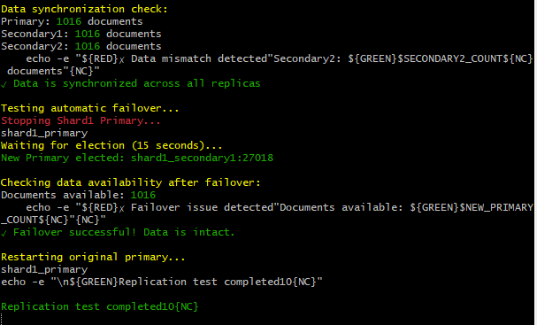
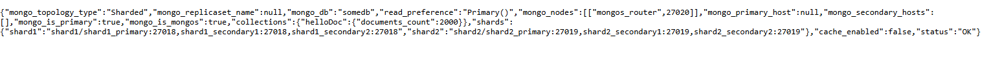

# pymongo-api

## Как запустить

переходим в папку со скриптами
```shell
cd путь-к-проекту\mongo-sharding-repl\scripts
```
выполняем скрипт init-cluster.sh
```shell
.\init-cluster.sh
```

## Как проверить

переходим в папку со скриптами
```shell
cd путь-к-проекту\mongo-sharding-repl\scripts
```

выполняем скрипт status-cluster.sh
```shell
.\status-cluster.sh
```

выполняем скрипт test-replication.sh
```shell
.\test-replication.sh
```

Результат:



Выводимых данных этих скриптов должно хватить

### Если вы запускаете проект на локальной машине

Откройте в браузере http://localhost:8080

### Если вы запускаете проект на предоставленной виртуальной машине

Узнать белый ip виртуальной машины

```shell
curl --silent http://ifconfig.me
```

Откройте в браузере http://<ip виртуальной машины>:8080

Результат в браузере



## Доступные эндпоинты

Список доступных эндпоинтов, swagger http://<ip виртуальной машины>:8080/docs