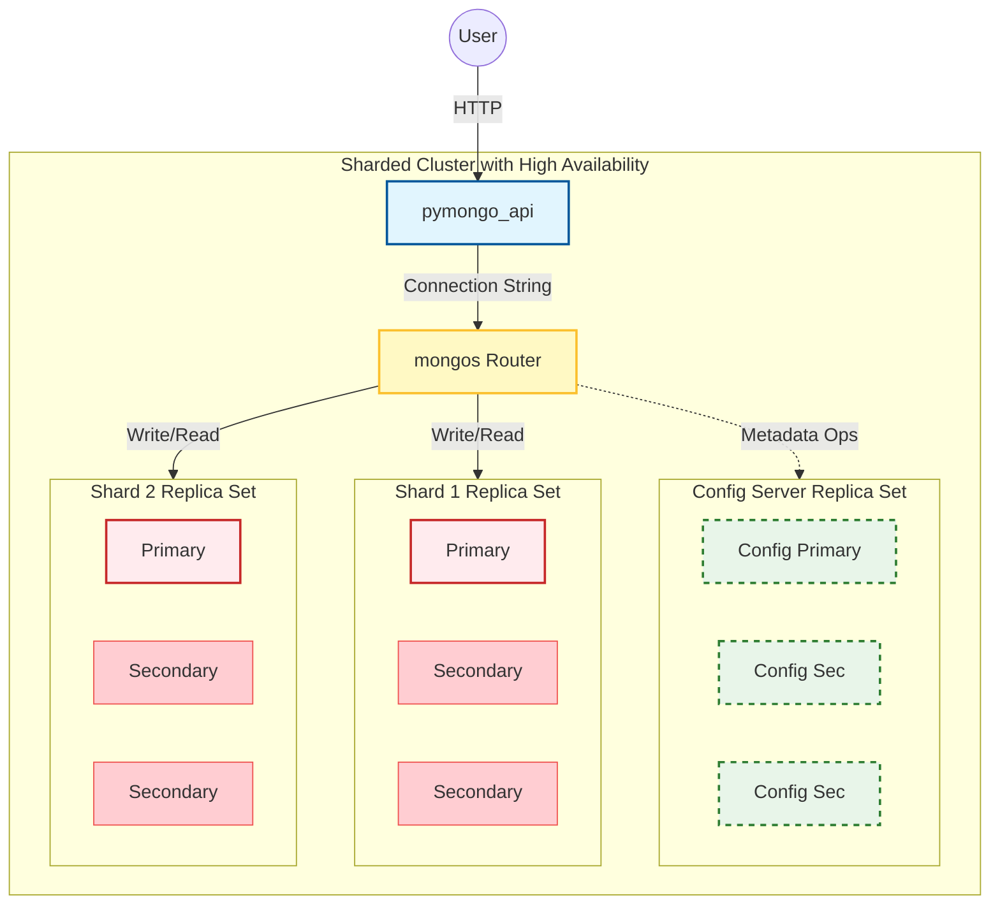

# Задание 3: Шардирование с Репликацией

В этой директории находится решение для **Задания 3**. Мы развиваем архитектуру из предыдущего задания, добавляя **отказоустойчивость (High Availability)**.

**Цель:** Обеспечить непрерывную работу базы данных даже при выходе из строя отдельных узлов. Для этого каждый компонент кластера (Config Server и каждый Shard) преобразуется в **Replica Set**.

## Архитектура решения

Теперь каждый логический узел в нашей шардированной топологии состоит из **трех физических инстансов**, объединенных в Replica Set. Это обеспечивает автоматическое переключение на резервный узел (failover) в случае сбоя.

*   **`mongos` (Router):** Как и раньше, единая точка входа.
*   **Config Server Replica Set (CSRS):** 3 узла, хранящие метаданные. Теперь этот компонент отказоустойчив.
*   **Shard 1 Replica Set:** 3 узла, хранящие первую половину данных.
*   **Shard 2 Replica Set:** 3 узла, хранящие вторую половину данных.



## Инструкция по запуску и настройке

Процесс запуска аналогичен предыдущему заданию, но включает большее количество контейнеров.

### Шаг 1: Запуск базовой инфраструктуры (все 9 узлов БД)

```bash
docker compose up -d configSrv1 configSrv2 configSrv3 shard1-1 shard1-2 shard1-3 shard2-1 shard2-2 shard2-3
```
Дождитесь, пока все контейнеры перейдут в статус `healthy` (проверить можно командой `docker compose ps`).

### Шаг 2: Инициализация Replica Set для серверов

Запускаем скрипт, который объединит узлы в три независимых Replica Set'а.

```bash
chmod +x init-sharding.sh
./init-sharding.sh
```

### Шаг 3: Запуск роутера и приложения

```bash
docker compose up -d
```

### Шаг 4: Финальная настройка кластера

Запускаем скрипт инициализации повторно. Он свяжет Replica Set'ы шардов с роутером. Ошибки `already initialized` для реплик являются ожидаемыми.

```bash
./init-sharding.sh
```

## Проверка работоспособности

**1. Загрузка тестовых данных**

```bash
chmod +x load-data.sh
./load-data.sh
```

**2. Проверка распределения данных по шардам**

```bash
chmod +x check-shards.sh
./check-shards.sh
```
Результат должен показать примерно равное распределение документов (например, `492 / 508`).

**3. (Опционально) Тест на отказоустойчивость**

Вы можете симулировать сбой, остановив один из `primary` узлов (например, `shard1-1`), и убедиться, что система продолжает работать.

```bash
docker kill shard1-1
sleep 15 # Даем время на выборы нового primary
./check-shards.sh # Скрипт должен отработать успешно, показав те же 1000 документов
```

## Остановка и очистка

```bash
docker compose down -v
```
