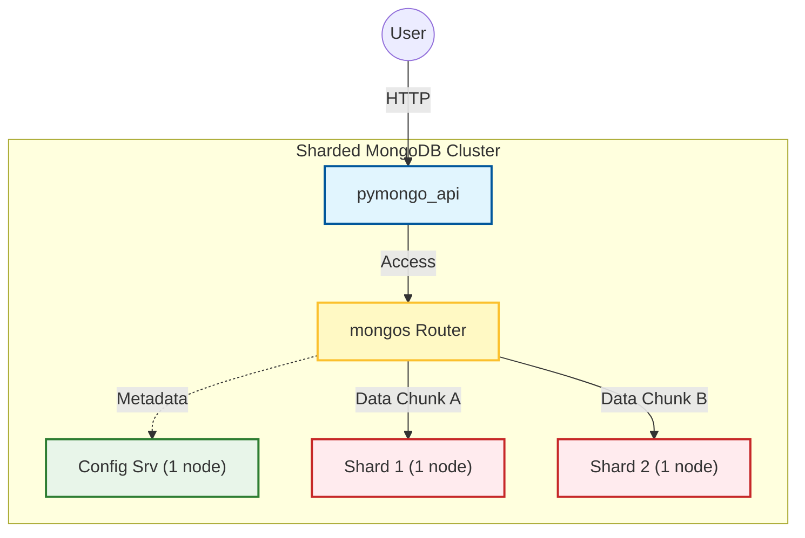

# Задание 2: Шардирование MongoDB

В этой директории находится решение для **Задания 2**, которое реализует первый этап масштабирования базы данных "Мобильного мира" — **шардирование**.

**Цель:** Распределить данные и нагрузку по нескольким узлам MongoDB (шардам) для повышения производительности и обеспечения горизонтального масштабирования.

## Архитектура решения

Решение разворачивает в Docker минимально необходимую шардированную топологию MongoDB, состоящую из следующих компонентов:

*   **`mongos` (Router):** Единая точка входа для приложения. Принимает запросы и направляет их на нужный шард.
*   **`configSrv` (Config Server):** Хранит метаданные кластера — карту, на каком шарде какие данные лежат.
*   **`shard1` & `shard2`:** Два независимых шарда, на которых физически хранятся данные.
*   **`pymongo_api`:** Сервис приложения, который теперь подключается к роутеру `mongos`.



## Инструкция по запуску и настройке

> **Важно:** Из-за зависимости `mongos` от уже инициалированного `configSrv`, запуск и настройка кластера производятся в несколько этапов. Пожалуйста, следуйте шагам в указанном порядке.

### Шаг 1: Запуск базовой инфраструктуры (серверы БД)

Сначала поднимаем только контейнеры с базами данных, без роутера.

```bash
docker compose up -d configSrv shard1 shard2
```

### Шаг 2: Инициализация Replica Set для серверов

Запускаем скрипт, который превратит одиночные инстансы в Replica Set (обязательное условие для шардинга). На этом шаге скрипт частично выполнится, выдав ожидаемые ошибки для `mongos` (т.к. он еще не запущен).

```bash
chmod +x init-sharding.sh
./init-sharding.sh
```

### Шаг 3: Запуск роутера и приложения

Теперь, когда Config Server готов, поднимаем оставшиеся сервисы. `mongos` должен успешно стартовать.

```bash
docker compose up -d
```
Убедитесь, что все контейнеры имеют статус `healthy` с помощью команды `docker compose ps`.

### Шаг 4: Финальная настройка кластера

Запускаем скрипт инициализации еще раз. Теперь он успешно выполнит команды для `mongos`: добавит шарды и включит шардинг для базы данных `somedb`.

> **Примечание:** Первые три команды в скрипте (инициализация `configSrv` и шардов) выдадут ошибку `MongoServerError: already initialized`. **Это ожидаемое поведение**, так как мы уже настроили их на Шаге 2.

```bash
./init-sharding.sh
```

## Проверка работоспособности

После выполнения всех шагов кластер полностью готов к работе.

**1. Проверка API и топологии кластера**

Выполните запрос к API. В ответе `mongo_topology_type` должен быть `"Sharded"`.

```bash
curl -s http://localhost:8080/ | python3 -m json.tool
```

**2. Загрузка тестовых данных**

Запускаем скрипт, который наполнит базу 1000 документами через `mongos`.

```bash
chmod +x load-data.sh
./load-data.sh
```

**3. Проверка распределения данных по шардам**

Этот скрипт проверяет, что данные действительно распределились между шардами.

```bash
chmod +x check-shards.sh
./check-shards.sh
```

Ожидаемый результат (цифры могут незначительно отличаться):

```
🧐 Checking data distribution...
🌍 Total in Mongos: 1000
📦 Shard 1 count:  492
📦 Shard 2 count:  508
---------------------------------
✅ SUCCESS: Data is sharded!
```

## Остановка и очистка

Для полной остановки и удаления контейнеров, сетей и вольюмов выполните:

```bash
docker compose down -v
```