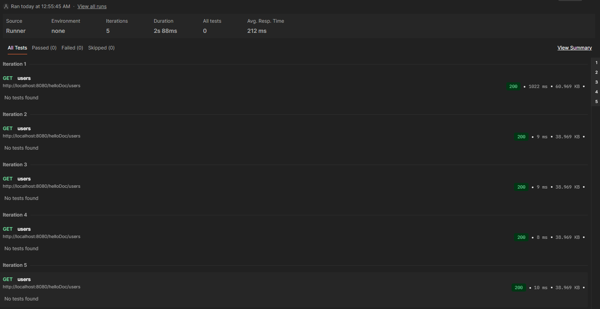

# Шардирование с репликацией и кэшированием

Этот проект реализует MongoDB кластер с шардированием, репликацией для каждого шарда и кэшированием через Redis.

## Архитектура

- **Mongos Router**: точка входа в кластер
- **Redis**: кеш для приложения
- **Config Servers**: 3 узла в реплика-сете `cfgReplSet`
- **Shard 1**: 3 узла в реплика-сете `shard1RS` (primary + 2 secondary)
- **Shard 2**: 3 узла в реплика-сете `shard2RS` (primary + 2 secondary)

## Запуск проекта

1. **Запустите все сервисы:**
   ```bash
   docker compose up -d
   ```

2. **Дождитесь инициализации кластера:**
   Проверьте логи сервиса `cluster-init`:
   ```bash
   docker compose logs cluster-init
   ```
   Дождитесь сообщения `===> Cluster initialization complete`

3. **Заполнение базы данных тестовыми данными:**
   Заполнение базы данных происходит автоматически через сервис `mongo-data-init` после успешной инициализации кластера. Сервис использует скрипт `scripts/mongo-init.sh`, который автоматически определяет, запущен ли он внутри Docker контейнера или на хосте, и использует соответствующий способ подключения к MongoDB.
   
   Проверьте логи:
   ```bash
   docker compose logs mongo-data-init
   ```
   Дождитесь сообщения об успешном завершении инициализации данных.
   
   **Примечание:** Если нужно заполнить базу данных вручную с хоста, можно использовать скрипт `scripts/mongo-init.sh` (требует запущенного Docker Compose):
   ```bash
   chmod +x scripts/mongo-init.sh
   ./scripts/mongo-init.sh
   ```
   
   Скрипт `mongo-init.sh` универсален и работает как внутри Docker контейнера (через прямое подключение к `mongos-router`), так и с хоста (через `docker compose exec`).

## Проверка работы

### Проверка через API

Откройте в браузере или выполните запрос:
```bash
curl http://localhost:8080/
```

Ответ должен содержать:
- `total_documents` - общее количество документов в базе (≥ 1000)
- `shards` - информация о каждом шарде с количеством документов в каждом
- `replicas_count` - количество реплик для каждого шарда
- `collections` - информация о коллекциях

### Пример ответа:

```json
{
  "total_documents": 1000,
  "shards": {
    "shard1RS": {
      "host": "shard1RS/shard1-1:27018,shard1-2:27018,shard1-3:27018",
      "documents_count": 500
    },
    "shard2RS": {
      "host": "shard2RS/shard2-1:27018,shard2-2:27018,shard2-3:27018",
      "documents_count": 500
    }
  },
  "replicas_count": {
    "shard1RS": 3,
    "shard2RS": 3
  },
  "collections": {
    "helloDoc": {
      "documents_count": 1000
    }
  },
  "status": "OK"
}
```

При первом запуске получения списка `users` запрос выполняется около секунды, а следующие запросы выполняются быстрее.



## Настройка репликации для каждого шарда

Репликация настраивается автоматически при запуске проекта через сервис `cluster-init`. Однако, если вам нужно настроить репликацию вручную, следуйте инструкциям ниже.

### Ручная настройка репликации для Shard 1

1. **Подключитесь к первому узлу шарда 1:**
   ```bash
   docker exec -it shard1-1 mongosh --port 27018
   ```

2. **Инициализируйте реплика-сет:**
   ```javascript
   rs.initiate({
     _id: "shard1RS",
     members: [
       { _id: 0, host: "shard1-1:27018" },
       { _id: 1, host: "shard1-2:27018" },
       { _id: 2, host: "shard1-3:27018" }
     ]
   })
   ```

3. **Дождитесь выбора PRIMARY узла:**
   ```javascript
   rs.status()
   rs.isMaster()
   ```

### Ручная настройка репликации для Shard 2

1. **Подключитесь к первому узлу шарда 2:**
   ```bash
   docker exec -it shard2-1 mongosh --port 27018
   ```

2. **Инициализируйте реплика-сет:**
   ```javascript
   rs.initiate({
     _id: "shard2RS",
     members: [
       { _id: 0, host: "shard2-1:27018" },
       { _id: 1, host: "shard2-2:27018" },
       { _id: 2, host: "shard2-3:27018" }
     ]
   })
   ```

3. **Дождитесь выбора PRIMARY узла:**
   ```javascript
   rs.status()
   rs.isMaster()
   ```

### Добавление шардов в mongos

После настройки репликации для обоих шардов, необходимо добавить их в mongos:

1. **Подключитесь к mongos:**
   ```bash
   docker exec -it mongos-router mongosh
   ```

2. **Добавьте шарды:**
   ```javascript
   sh.addShard("shard1RS/shard1-1:27018")
   sh.addShard("shard2RS/shard2-1:27018")
   ```

3. **Включите шардирование для базы данных:**
   ```javascript
   sh.enableSharding("somedb")
   ```

4. **Проверьте статус кластера:**
   ```javascript
   sh.status()
   ```

## Проверка репликации

### Проверка статуса реплика-сета Shard 1

```bash
docker exec -it shard1-1 mongosh --port 27018 --eval "rs.status()"
```

### Проверка статуса реплика-сета Shard 2

```bash
docker exec -it shard2-1 mongosh --port 27018 --eval "rs.status()"
```

### Проверка через mongos

```bash
docker exec -it mongos-router mongosh --eval "sh.status()"
```

## Остановка проекта

```bash
docker compose down
```

Для полной очистки данных (включая volumes):

```bash
docker compose down -v
```

## Управление кешем Redis

Для проверки и управления ключами кеша в Redis доступен PowerShell скрипт `scripts/redis-cache-manager.ps1`.

### Использование скрипта:

```powershell
# Запуск скрипта (по умолчанию использует Docker)
.\scripts\redis-cache-manager.ps1

# Или с параметрами
.\scripts\redis-cache-manager.ps1 -RedisHost localhost -RedisPort 6379 -CachePrefix "api:cache" -UseDocker
```

### Возможности скрипта:

1. **Показать все ключи кеша** - отображает все ключи с префиксом `api:cache`
2. **Показать количество ключей** - выводит общее количество ключей кеша
3. **Показать ключи с деталями** - отображает ключи с информацией о TTL, типе и размере
4. **Удалить конкретный ключ** - позволяет выбрать и удалить конкретный ключ из списка
5. **Удалить все ключи кеша** - полная инвалидация кеша (требует подтверждения)
6. **Показать статистику Redis** - выводит общую статистику Redis (команды, память, keyspace)

### Примеры использования:

```powershell
# Проверка подключения к Redis
docker exec redis-1 redis-cli ping

# Просмотр всех ключей кеша через redis-cli
docker exec redis-1 redis-cli KEYS "api:cache*"

# Удаление всех ключей кеша через redis-cli
docker exec redis-1 redis-cli --scan --pattern "api:cache*" | xargs docker exec redis-1 redis-cli DEL
```

## Доступные эндпоинты

- `GET /` - информация о кластере, количестве документов, шардах и репликах
- `GET /{collection_name}/count` - количество документов в коллекции
- `GET /{collection_name}/users` - список пользователей (с кешированием)
- `GET /{collection_name}/users/{name}` - получить пользователя по имени
- `POST /{collection_name}/users` - создать нового пользователя
- `GET /docs` - Swagger документация

