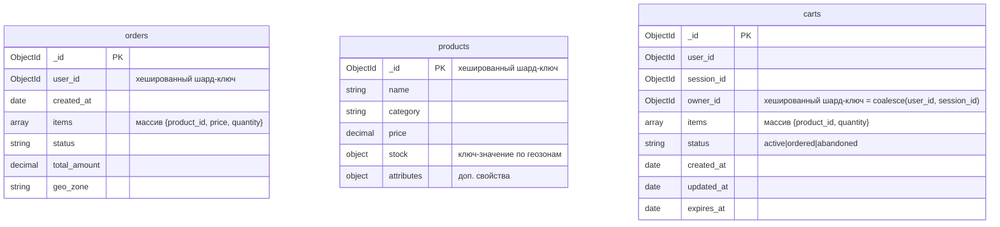

# Схема данных онлайн-магазина «Мобильный мир»

## 1. ER-диаграмма коллекций

## 2. Детальные схемы коллекций

### 2.1. `orders` – заказы

| Поле          | Тип          | Обязательное | Описание |
|---------------|--------------|--------------|----------|
| `_id`         | `ObjectId`   | да           | Уникальный идентификатор заказа |
| `user_id`     | `ObjectId`   | да           | Идентификатор пользователя (хешированный шард-ключ) |
| `created_at`  | `Date`       | да           | Дата и время оформления заказа |
| `items`       | `array`      | да           | Список товаров: `[{ product_id, price, quantity }]` |
| `status`      | `string`     | да           | Статус заказа |
| `total_amount`| `decimal`    | да           | Общая сумма заказа |
| `geo_zone`    | `string`     | да           | Геозона заказа |

**Индексы:**
- шард-ключ: `{ user_id: "hashed" }`
- составной для истории: `{ user_id: 1, created_at: -1 }`

Данный шард-ключ был выбран из следующих соображений:
Хочется, чтобы данные по пользователям были равномерно распределены по кластеру, т.к. работа с данной таблицей идет в основном с поиском по пользователю для отображения истории заказов. Если все данные по пользователям будут лежать на одной ноде, данный поиск будет осуществляться достаточно быстро. 
В качестве альтернативы был также рассмотрен гео-распределенный ключ по geo_zone, но не был взят как основной, т.к. больше города, такие как Санкт-Петербург или Москва будут явно нагружать свои шарды сильнее, чем все остальные.

**Команды MongoDB:**
Здесь и далее за основу в качестве примера используется кластер БД, созданный в Задание 4 (каталог task4 в данном репозитоии)

Подключение к БД:
docker exec -it mongos_router1 mongosh --port 27020

1. Создание и шардирование коллекции orders:
sh.shardCollection("somedb.orders", { "user_id": "hashed" })
2. Дополнительный индекс для истории заказов пользователя
db = db.getSiblingDB("somedb")
db.orders.createIndex({ "user_id": 1, "created_at": -1 })

### 2.2. `products` – товары

| Поле          | Тип          | Обязательное | Описание |
|---------------|--------------|--------------|----------|
| `_id`         | `ObjectId`   | да           | Уникальный идентификатор товара (хешированный шард-ключ) |
| `name`        | `string`     | да           | Наименование |
| `category`    | `string`     | да           | Категория товара |
| `price`       | `decimal`    | да           | Цена |
| `stock`       | `object`     | да           | Остатки по геозонам: `{ "<зона>": <количество> }` |
| `attributes`  | `object`     | нет          | Дополнительные атрибуты (цвет, размер) |

**Индексы:**
- шард-ключ: `{ _id: "hashed" }`
- составной для поиска: `{ category: 1, price: 1 }`

В качестве шард-ключа был выбран хэшированный ключ по УН товара. Данный выбор обусловлен тем, что он позволит равномерно распределить данные по кластеру.
В качестве альтернативы рассматривался ключ по категории. Минусом данного ключа является потенциальная "популярность" конкретной категории товара, и перегрев одного из шарда. Плюсом является хранение всей категории в одном шарде, что позволит осуществлять быстрый поиск по категории и цене, которые необходимы для фильтрации товаров на странице с фильтрами. 
В качестве компромисса был добавлен составной индекс во всем кластере для ускорения поиска в разделе и фильтрами { category: 1, price: 1 }.

**Команды MongoDB:**
1. Создание и шардирование коллекции products:
sh.shardCollection("somedb.products", { "_id": "hashed" })
2. Составной индекс для поиска по категории и цене
db.products.createIndex({ "category": 1, "price": 1 })

### 2.3. `carts` – корзины

| Поле          | Тип          | Обязательное | Описание |
|---------------|--------------|--------------|----------|
| `_id`         | `ObjectId`   | да           | Уникальный идентификатор корзины |
| `user_id`     | `ObjectId`   | нет          | Идентификатор авторизованного пользователя (null для гостей) |
| `session_id`  | `ObjectId`   | нет          | Идентификатор гостевой сессии (null для авторизованных) |
| `owner_id`    | `ObjectId`   | да           | Вычисляемое поле: `coalesce(user_id, session_id)`. Хешированный шард-ключ |
| `items`       | `array`      | да           | Товары: `[{ product_id, quantity }]` |
| `status`      | `string`     | да           | `active`, `ordered`, `abandoned` |
| `created_at`  | `Date`       | да           | Дата создания |
| `updated_at`  | `Date`       | да           | Дата последнего изменения |
| `expires_at`  | `Date`       | да           | Время автоматического удаления (TTL) |

**Индексы:**
- шард-ключ: `{ owner_id: "hashed" }`
- составной для активной корзины: `{ owner_id: 1, status: 1 }`
- TTL-индекс: `{ expires_at: 1 }` (expireAfterSeconds: 0)

В качестве шард-ключа предложено использовать новое поле owner_id, которое является вычисляемым (coalesce(user_id, session_id)). В MongoDB по умолчанию нет вычисляемых индексов, поэтому предполагается, что данное поле будет вычисляться на уровне приложения, и записываться в БД в готовом виде. Для имеющихся записей потребуется дозаполнение данного поля. Хэш-ключ по данному полю позволит равномерно распределить данные по кластеру БД, а также достаточно быстро осуществлять необходимый поиск из сценария подмены корзины "гостя" корзиной "авторизованного пользователя", т.к. и гостевая корзина, и корзина авторизованного пользователя будут попадать в один шард БД, и запрос не будет распределенным.

**Команды MongoDB:**
1. Создание и шардирование коллекции products:
sh.shardCollection("somedb.carts", { "owner_id": "hashed" })
2. Составной индекс для быстрого поиска активной корзины владельца
db.carts.createIndex({ "owner_id": 1, "status": 1 })
3. TTL-индекс для автоматического удаления устаревших корзин
db.carts.createIndex(
  { "expires_at": 1 },
  { expireAfterSeconds: 0 }
)

### Тестирование распределения
1. Подключение к БД
use somedb

2. Вспомогательная функция для случайного выбора элемента массива
function randomItem(arr) {
  return arr[Math.floor(Math.random() * arr.length)];
}

3. Вспомогательная функция для случайного числа в диапазоне
function randomInt(min, max) {
  return Math.floor(Math.random() * (max - min + 1)) + min;
}

4. Генерация 1000 товаров (products):
const categories = ["Электроника", "Аксессуары", "Аудио", "Бытовая техника", "Книги"];
const geoZones = ["Москва", "Санкт-Петербург", "Екатеринбург", "Калининград", "Казань"];

for (let i = 0; i < 1000; i++) {
  const category = randomItem(categories);
  const stock = {};
  geoZones.forEach(zone => { stock[zone] = randomInt(0, 200); });

  db.products.insertOne({
    name: `${category} товар ${i + 1}`,
    category: category,
    price: NumberDecimal((Math.random() * 50000 + 100).toFixed(2)),
    stock: stock,
    attributes: {
      color: randomItem(["черный", "белый", "серебристый", "красный", "синий"]),
      size: randomItem(["S", "M", "L", "XL", "128GB", "256GB"])
    }
  });
}
print("Вставлено 1000 товаров");

5. Генерация 1000 заказов (orders)
// Получим массив _id всех товаров для случайной привязки
const productIds = db.products.find({}, { _id: 1 }).toArray().map(p => p._id);
const statuses = ["new", "processing", "completed", "cancelled"];

for (let i = 0; i < 1000; i++) {
  // Генерируем случайного пользователя (новый ObjectId каждый раз)
  const userId = new ObjectId();
  
  // Создаём 1-3 случайные позиции в заказе
  const itemsCount = randomInt(1, 3);
  const items = [];
  let total = 0;
  for (let j = 0; j < itemsCount; j++) {
    const prodId = randomItem(productIds);
    const quantity = randomInt(1, 5);
    // Для простоты цену берём случайную
    const price = NumberDecimal((Math.random() * 50000 + 100).toFixed(2));
    items.push({
      product_id: prodId,
      price: price,
      quantity: quantity
    });
    total += parseFloat(price.toString()) * quantity;
  }

  db.orders.insertOne({
    user_id: userId,
    created_at: new Date(Date.now() - randomInt(0, 365 * 24 * 60 * 60 * 1000)),
    items: items,
    status: randomItem(statuses),
    total_amount: NumberDecimal(total.toFixed(2)),
    geo_zone: randomItem(geoZones)
  });
}
print("Вставлено 1000 заказов");

6. Генерация 1000 корзин (carts)
for (let i = 0; i < 1000; i++) {
  const isGuest = Math.random() < 0.3;
  let userId = null;
  let sessionId = null;
  let ownerId;

  if (isGuest) {
    sessionId = new ObjectId();
    ownerId = sessionId;
  } else {
    userId = new ObjectId();
    ownerId = userId;
  }

  const itemsCount = randomInt(0, 5);
  const items = [];
  for (let j = 0; j < itemsCount; j++) {
    items.push({
      product_id: randomItem(productIds),
      quantity: randomInt(1, 3)
    });
  }

  const created = new Date(Date.now() - randomInt(0, 30 * 24 * 60 * 60 * 1000));
  
  db.carts.insertOne({
    user_id: userId,
    session_id: sessionId,
    owner_id: ownerId,
    items: items,
    status: randomItem(cartStatuses),
    created_at: created,
    updated_at: new Date(created.getTime() + randomInt(0, 3600000)),
    expires_at: new Date(Date.now() + 24 * 60 * 60 * 1000) // всегда будущее время, чтобы данные сутки могли пожить
  });
}

7. Проверка, что данные равномерно распределились по шардам:
db.products.getShardDistribution()
db.orders.getShardDistribution()
db.carts.getShardDistribution()

Распределение по шардам ~50% в каждом, как и ожидалось. 

# Задание 8. Выявление и устранение «горячих» шардов

В данной гипотетической конфигурации коллекция products, вероятно, шардирована по ключу, основанному на категории товара (например, { category: 1 } или { category: "hashed" }). Это привело к тому, что все документы популярной категории «Электроника» (около 70% запросов) оказались на одном шарде. 

## 8.1. Ключевые метрики MongoDB

| Метрика | Источник | Описание |
|---------|----------|----------|
| **Распределение чанков** | `sh.status()` / `printShardingStatus()` | Количество чанков на каждом шарде. Резкая разница (например, 100+ чанков на одном шарде при 2–3 на остальных) сигнализирует о дисбалансе. |
| **Количество документов на шард** | `db.products.getShardDistribution()` | Абсолютное число документов. При шардировании по `category` одна категория может содержать 70% документов, что сразу видно. |
| **Количество операций на шард (ops/sec)** | `db.currentOp()` / профайлер / внешний мониторинг (Prometheus) | Показывает, на какие шарды приходит основная масса запросов. Дисбаланс в 70/30 – критический признак. |
| **Загрузка CPU / дисковая IO** | Системный мониторинг (top, iostat, экспортёр MongoDB) | Высокий CPU/IO на одном из узлов при нормальной нагрузке на других. |
| **Средняя задержка запросов по шардам** | Профайлер MongoDB или APM-инструменты (db.setProfilingLevel(1, { slowms: 100 })) | Рост латентности на горячем шарде – следствие перегрузки. |
| **Статистика балансировщика** | `sh.getBalancerState()`, `sh.isBalancerRunning()` | Балансировщик автоматически перемещает чанки, но при ключе по категории он не может решить проблему однородных данных. |
| **Размер данных на шард** | `db.runCommand({ dbStats: 1, scale: 1 })` для каждой базы | Отражает физический объём, занятый документами на шарде. Перекосы в большую, или меньшую сторону - сигнал о пересмотре ключа-шардирования |

Если исходить из позиции, что все продукты из категории "Электроника" оказались на одном шарде по причине диапазонного, или хэш-ключа по категории, тогда для перераспределения данных придется использовать механизм решардинга. В качестве нового ключа будем использовать хэш-ключ по УН. Данный ключ позволит равномерно распределить данные по кластеру БД. Однако, вместе с этим, ряд запросов станут распределенными. В частности, поиск товаров по категории и цене, станет медленнее. Для того, чтобы нивелировать данную проблему, в задании 7 было предложено использование составного индекса: { category: 1, price: 1 }. 

**MongoDb-команда для решардинга коллекции товаров:**
db.adminCommand({
  reshardCollection: "somedb.products",
  key: { _id: "hashed" }
})

На время пока решардинг в процессе обработки, можно часть нагрузки увести на чтение из secondary-реплик.

# Задание 9. Настройка чтения с реплик и консистентность
В шардированном кластере MongoDB каждая реплика-сет шарда содержит primary и secondary узлы. Это позволяет масштабировать чтение за счёт распределения запросов на вторичные реплики. Однако данные на secondary могут отставать от primary из-за задержки репликации.

## 1. Коллекция `orders`

| Операция | Источник чтения | Допустимая задержка репликации | Обоснование |
|----------|------------------|--------------------------------|-------------|
| **История заказов пользователя** – `find({ user_id })` | `secondary` | до 2–3 секунд | Данные о завершённых заказах меняются редко (в основном создаются новые). Незначительная задержка не критична для пользователя, просматривающего историю. |
| **Статус конкретного заказа** (при оплате, проверке статуса) | `primary` | 0 | Статус заказа может меняться в реальном времени (оплата, отмена). Клиент должен видеть актуальное состояние, чтобы избежать повторных действий или неверных решений. |
| **Создание заказа** | `primary` (запись) | — | Операция записи, всегда выполняется на primary. |

## 2. Коллекция `products`

| Операция | Источник чтения | Допустимая задержка репликации | Обоснование |
|----------|------------------|--------------------------------|-------------|
| **Карточка товара** (`findOne({ _id })`) | `secondary` | до 5 секунд | Цена, описание и атрибуты товара обновляются редко. Небольшое отставание несущественно для пользовательского восприятия. |
| **Поиск товаров по категории и фильтру цены** | `secondary` | до 5 секунд | Аналогично карточке товара — допустимо показывать слегка устаревшие цены при поиске. При этом на странице товара перед покупкой всё равно будет запрос к primary для гарантии актуальной цены и наличия. |
| **Обновление остатков** | `primary` (запись) | — | Критически важно списывать остатки атомарно и точно. Запись всегда на primary. |

## 3. Коллекция `carts`

| Операция | Источник чтения | Допустимая задержка репликации | Обоснование |
|----------|------------------|--------------------------------|-------------|
| **Получение активной корзины** (`findOne({ owner_id, status: "active" })`) | `primary` | 0 | Корзина часто модифицируется (добавление/удаление товаров, изменение количества). Пользователь должен видеть актуальное состояние, иначе возможны коллизии (например, добавление товара в корзину, которая уже была изменена). |
| **Слияние гостевой корзины в пользовательскую** | `primary` | 0 | Модифицирующая операция, требующая транзакции. Все чтения внутри транзакции также должны идти на primary. |
| **Создание корзины, добавление/удаление товаров, отметка как заказанной** | `primary` (запись) | — | Операции записи. |

**Примечание:** для carts все пользовательские чтения должны выполняться на primary, чтобы обеспечить строгую консистентность. Это не создаст чрезмерной нагрузки, так как активная корзина запрашивается относительно редко (обычно один раз при загрузке страницы).

## 4. Обоснование выбора допустимой задержки репликации

- **0 секунд (primary):** операции, где несвежие данные могут привести к ошибочным действиям (например, оплата уже отменённого заказа, покупка товара с неверным остатком, потеря товаров в корзине при слиянии).
- **2–5 секунд (secondary):** информационные запросы, не влияющие на бизнес-транзакции. Риски незначительны: пользователь может увидеть чуть устаревшую цену или историю без последнего заказа, но это не приводит к финансовым или операционным потерям.